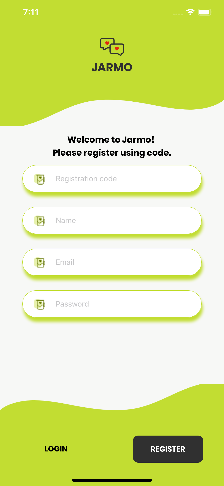
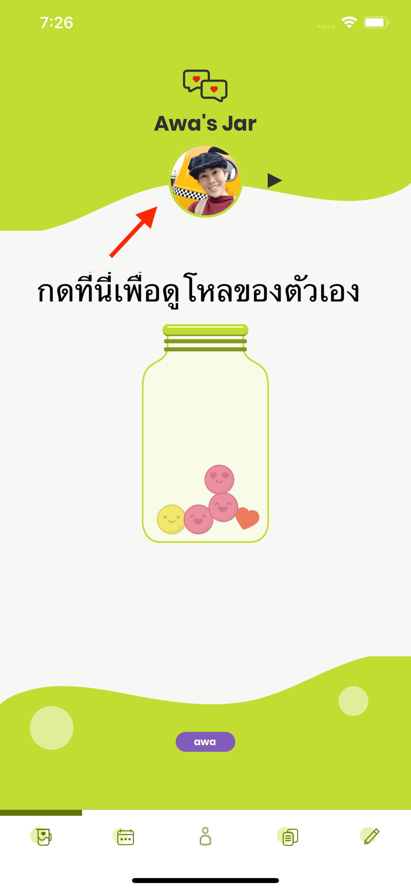
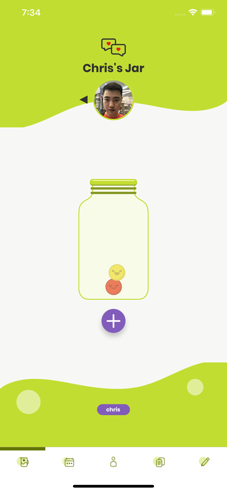
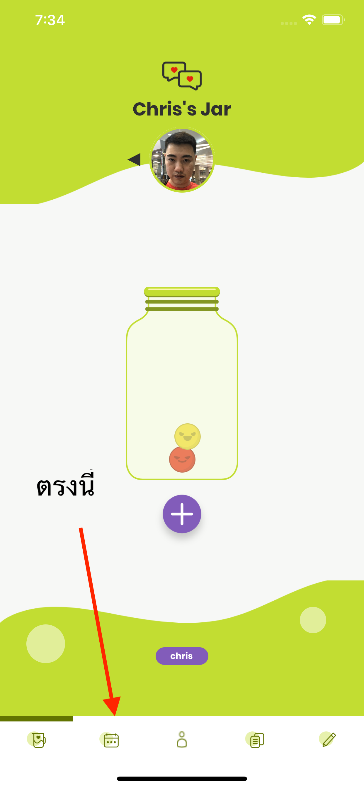
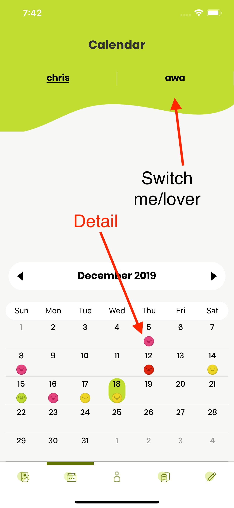
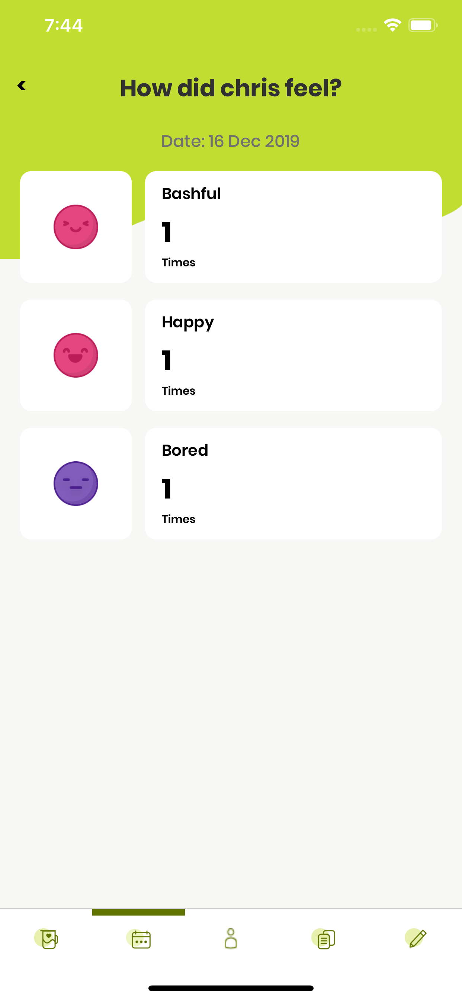
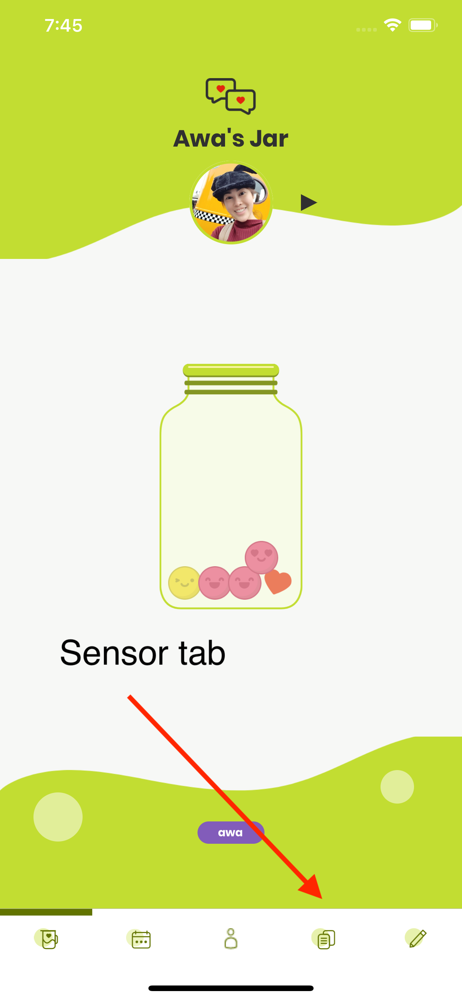
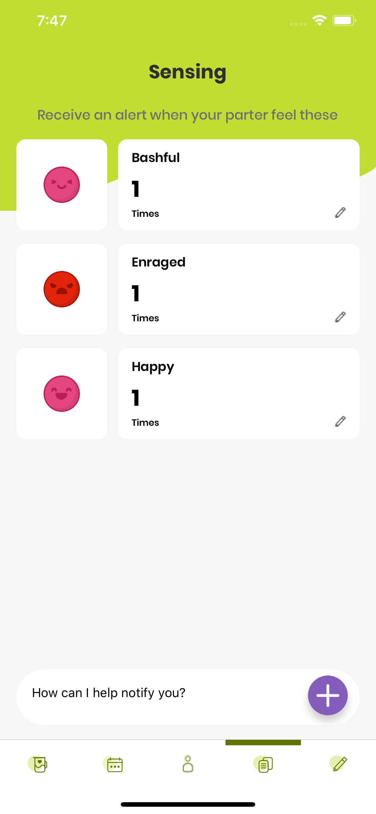
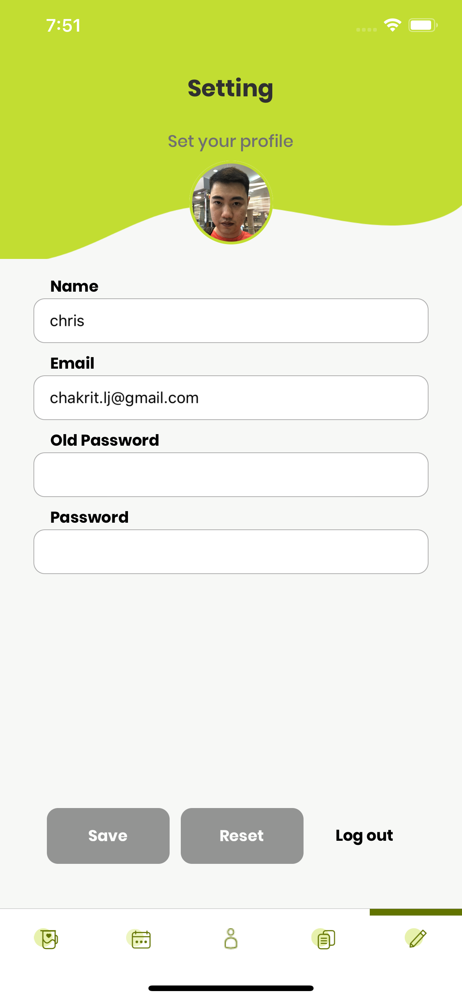

## Jarmo

[English manual here](./manual_en.md)

Jarmo เป็นแอพพลิเคชั่นที่เขียนขึ้นเพื่อเป็นของร่วยวันแต่งงานของ คุณชาคริต ลิขิตขจร และ คุณแพรวทิวา นิยมรัตน์ ในวันที่ 19 ธันวาคม

ขอขอบคุณแขกทุกท่านที่เข้ามาร่วมงานในวันมงคลนี้

แอพนี้จะถูกอัพเดทเรื่อยๆ ครับ เจ้าบ่าวจะพัฒนาให้เจ้าสาวใช้ เจ้าบ่าวจะแจ้งเตือนทุกท่านเมื่อแอพมีการอัพเดทนะครับ

ติดต่อเจ้าบ่าวผู้พัฒนาได้ที่อีเมล์ chakrit.lj@gmail.com

[Android](https://play.google.com/store/apps/details?id=com.chrisza.jarmotion)

[iOS](https://apps.apple.com/th/app/jarmotion/id1486016343)

### Concept

ระบบนี้ทำขึ้นเพื่อให้คู่รักสามารถสื่อสารความรู้สึกกัน โดยคอนเซปต์คือ แต่ละวันเรามีความรู้สึกใดอยากสื่อสาร ก็จะสื่อสารลงแอพ และอีกฝั่งสามารถตั่งค่าการดูแลให้แอพเตือนเมื่อคู่รักมีความรู้สึกต่างๆ ได้ เช่น ตั้งให้แจ้งเตือนเมื่ออีกฝั่งโกรธเกิน 3 ครั้งในหนึ่งวัน แจ้งเตือนเมื่ออีกฝั่งมีความสุขเกิน 2 ครั้ง

นอกจากนี้เรายังสามารถมาดูย้อนหลังได้ว่าแต่ละวันคู่รักมีความรู้สึกอะไรเกิดขึ้นบ้าง

### ลงทะเบียน

เมื่อเข้ามาครั้งแรกแอพจะเข้ามาสู่หน้าลงทะเบียนดังนี้

- ใส่รหัสลงทะเบียนที่ได้รับในช่อง Registration code
- ใส่ชื่อเล่นหรือชื่อที่ต้องการใช้ในช่อง Name
- ใส่ Email ของคุณในช่อง Email
- ใส่รหัสผ่านที่ต้องการใช้ในช่อง Password

### การใช้งานพื้นฐาน

เมื่อเข้ามาครั้งแรกระบบจะขอให้คุณเพิ่มคู่รัก

จะต้องมีฝ่ายหนึ่งแสดง QR ของตัวเอง ด้วยการกด My QR และอีกฝั่งเพิ่มคู่รักของตนโดยการกด Add lover

เมื่อเพิ่มเสร็จระบบจะพาเข้ามาสู่หน้าจอโหลดังนี้

หน้าจอนี้จะเป็นหน้าจอดูความรู้สึกของคู่รักของคุณในวันนี้

คุณสามารถกดเพื่อดูโหลของตัวเองได้ โดยการกดที่วงกลมตรงกลาง

ในโหลจองตัวเอง คุณสามารถเพิ่มความรู้สึกในแต่ละวันของคุณได้ โดยการกดปุ่ม + และเลือกความรู้สึกที่คุณรู้สึก

### การดูความรู้สึกย้อนหลัง

เราสามารถดูความรู้สึกย้อนหลังได้โดยกดที่ Tab ที่สอง

ซึ่งเมื่อกดไปครั้งแรกจะมีภาพรวมของความรู้สึกของคุณและคู่รักในปฏิทินปรากฎให้ดู

เมื่อกดในปฏิทินจะมีรายละเอียดให้ดูว่าในวันนั้นมีความรู้สึกอะไรบ้าง

### การตั้งค่าแจ้งเตือน

เราสามารถตั้งค่าแต้งเตือนได้ใน Tab นี้

สามารถกดปุ่ม + ตรงด้านล่างขวาเพื่อเพิ่มว่าต้องการให้ระบบแจ้งเตือนเมื่อคู่รักรู้สึกอะไร และแก้ไขจำนวนเลขโดยการกดที่ตัวเลข

หากต้องการลบออกให้กดเลขเป็น 0

### การตั้งรูปภาพและชื่อ

เราสามารถตั้งค่ารูปภาพตัวเองและเชื่อได้ที่ Tab นี้

หน้าจอนี้สามารถเปลี่ยนชื่อ, email, รหัสผ่านได้

หากต้องการเปลี่ยนรูปภาพให้กดที่วงกลม

### ส่งท้าย

สุดท้ายขอขอบคุณทุกท่านที่เข้ามาร่วมงาน หวังว่าท่านจะมีความสุขกับการใช้ระบบที่ข้าพเจ้าพัฒนาขึ้น

หากมีข้อสงสัยหรือมีปัญหาการใช้งาน กรุณาติดต่อคุณชาคริต ที่ chakrit.lj@gmail.com
