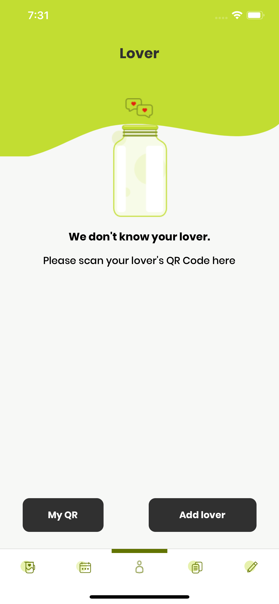
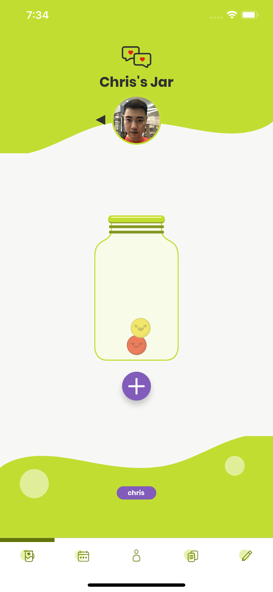
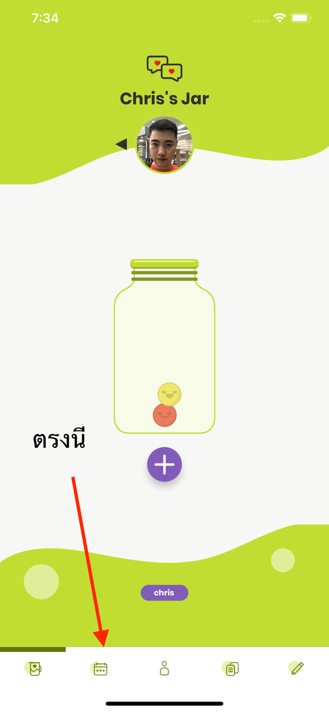
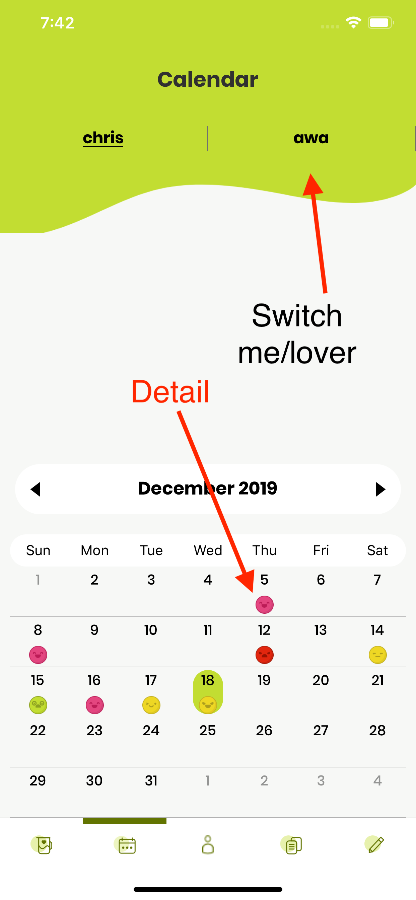
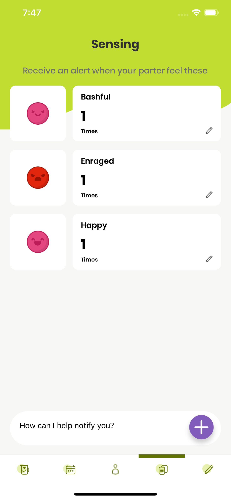

## Jarmo

[คุ่มือภาษาไทย ที่นี่](./manual.md)

Jarmo is an application developed and distributed as wedding souvenir by Chakrit Likitkhajorn and Plawtiwa Niyomrat on 19 December 2019.

Thank you every guest for attending our wedding ceremony.

This application will be updated. We will notify changes and updates through the app.

Have any question? Contact developer at chakrit.lj@gmail.com

[Android](https://play.google.com/store/apps/details?id=com.chrisza.jarmotion)

[iOS](https://apps.apple.com/th/app/jarmotion/id1486016343)

### Concept

The main idea is to communicate our day-to-day emotion with our lover.

Every day, you can send emotion to your lover. Your lover can set how he/she would take care of you by setting the sensor for an alert. For example, you can set that "please notify me if my lover is happy more than three times a day" or "please notify me if my lover is angry". You can then proceed from here. You can buy a real-life flower, take her to fancy dinner, or talk it through.

Also, both you and lover can see a history of your life. You can look back on how you feel each day.

### Registration

You will get a registration code at our wedding ceremony.

First, the application will take you to a registration page here

- Enter registration code
- Enter your nickname
- Enter your email
- Enter your password

### Basic usage

At first, the application will ask you to add your lover.

You can add lover by either displaying your QR code or press add lover and take a picture of your lover.

After that, the application will take you to jar page.

This is a page where we display your lover's today emotions.

If you click at the arrow or circle avatar on the middle of the screen, it will take you to your jar.

In your jar, you can press + to express your emotion to your lover.

### Emotion history

You can look at past emotions by pressing this tab.

At first glance, you will see an overall picture of you and your lover emotions in calendar format.

If you press calendar, you will see in emotions in detail.

### Sensing your lover emotion

You can set how you want to take care of your lover here.

In this tab, you can press + to set criteria to take care of your lover emotion. In the sample screen, I set the application to notify me when my wife is bashful, happy or bored.

You can remove setting by set the number to be zero.

### Profile

You can change your name and profile image in this tab.

If you want to change your profile picture, you can press the circle.

### Last but not least

We are grateful that you join our wedding. We will keep maintain and update this application.

Any question. Please contach developer: chakrit.lj@gmail.com
